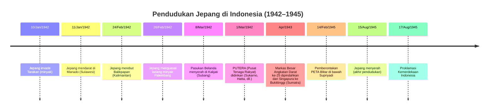

# Pendudukan Jepang di Indonesia (1942–1945): Laporan Penelitian Mendalam

## Ringkasan Eksekutif

Dari Maret 1942 hingga Agustus 1945, Jepang membongkar pemerintahan kolonial Belanda di Indonesia, menduduki kepulauan tersebut di bawah administrasi militer. Awalnya disambut oleh sebagian pihak sebagai pembebasan dari Belanda, kebijakan keras Jepang – terutama kerja paksa massal (romusha) dan requisisi pangan – menyebabkan penderitaan luas. Klaim korban kelaparan mencapai jutaan jiwa (Huff memperkirakan sekitar 2,4 juta kematian di Jawa), meskipun angka pasti masih diperdebatkan.

Jepang menata ulang administrasi (tiga wilayah militer) dan memanfaatkan pemimpin nasionalis (membentuk PUTERA, PETA, Masyumi, dll.) untuk mobilisasi dukungan. Pendidikan dan bahasa Indonesia berkembang di bawah pengawasan Jepang, dan tokoh-tokoh lokal seperti Sukarno dan Hatta memperoleh prominensi. Perlawanan bersenjata bersifat sporadis (misalnya Cot Plieng di Aceh 1942, pemberontakan PETA Supriyadi 1945), sementara banyak elit berkolaborasi dengan harapan memajukan kemerdekaan.

Penyalahgunaan oleh Jepang sangat parah: interniran sekitar 100.000 warga Eropa (sekitar 17% meninggal), kamp kerja paksa/POW yang brutal, eksekusi (misalnya staf Radio Batavia), dan perbudakan seksual (Jugun Ianfu). Warisan pendudukan ini kontroversial: menghancurkan struktur kolonial dan mempercepat organisasi nasionalis (membuka jalan bagi Proklamasi 17 Agustus 1945) namun meninggalkan luka mendalam.

Sumber dari periode 1942–1945 sangat terbatas (ANRI mencatat hampir tidak ada arsip era Jepang yang tersisa); peneliti menggunakan koleksi Jepang dan Belanda. Laporan ini menyajikan kronologi peristiwa, analisis tata kelola, kebijakan ekonomi, dampak sosial, perlawanan, pelanggaran HAM, serta peran pendudukan dalam jalan Indonesia menuju kemerdekaan, dilengkapi perbandingan regional dan isu historiografi utama.

---

## Kronologi Sejarah (1942–1945)

Pasukan Jepang melancarkan ofensif luas pada awal 1942.

- **Januari–Maret 1942**: Unit penyerang merebut ladang minyak Kalimantan (Tarakan, Balikpapan) dan mendarat di Jawa serta Sumatra.
- **8–9 Maret 1942**: Gubernur Jenderal Belanda Tjarda van Starkenborgh Stachouwer secara resmi menyerah di Kalijati (Jawa Barat), mengakhiri pemerintahan kolonial Belanda.
- **1942–1943**: Jepang mengonsolidasikan kontrol pulau demi pulau; membentuk badan-badan auxiliari Indonesia (PUTERA, PETA, liga pemuda) pada 1943.
- **1944–1945**: Perang berbalik merugikan Jepang. Kebijakan putus asa (autarki, requisisi beras maksimal) memicu kelaparan.
- **Awal 1945**: Jepang memberikan janji samar tentang "kemerdekaan" dan membentuk komite BPUPKI, PPKI.
- **15 Agustus 1945**: Jepang menyerah kepada Sekutu.
- **17 Agustus 1945**: Sukarno–Hatta memproklamasikan kemerdekaan Indonesia.

### Diagram Garis Waktu

---

## Administrasi Politik dan Tata Kelola

Setelah kapitulasi Maret 1942, Jepang membagi Indonesia di bawah pemerintahan militer:

- **Sumatra** (bersama Malaya): Di bawah Angkatan Darat ke-25 Jepang (Marsekal Terauchi) dengan markas di Bukittinggi (sejak April 1943).
- **Jawa** (dan Madura): Di bawah Angkatan Darat ke-16 (markas Batavia).
- **Kalimantan, Sulawesi, Maluku, Papua**: Dikendalikan oleh Armada Selatan ke-2 Angkatan Laut (markas Makassar).

Setiap wilayah dipimpin oleh Gunseikan (gubernur militer) yang mengawasi urusan sipil. Struktur kolonial Belanda diganti secara formal: di Jawa, residensi Belanda direkonstitusi menjadi 17 "syu" (unit provinsi). Di atasnya terdapat Gun (郡) dan Ku (区) yang menggantikan kabupaten/desa Belanda.

Administrasi sipil memiliki tiga tingkatan:
1. Komandan militer tertinggi Jepang (Gunshireikan)
2. Kepala staf (Gunseikan)
3. Komandan wilayah (Gunseibu) untuk Jawa Barat, Jawa Tengah, Jawa Timur, dll.

Pejabat Indonesia sering dipertahankan di posisi rendah di bawah pengawasan Jepang. Jepang mengizinkan sebagian pemimpin nasionalis menduduki posisi: Sukarno dan Hatta menjabat sebagai fungsionaris junior (misalnya dalam propaganda atau organisasi kolaborasi), dan pemimpin Muslim seperti K.H. Hasyim Asy'ari menjalankan Masyumi yang direorganisasi di bawah patronase Jepang.

Jepang melarang semua badan politik Belanda (Volksraad dibubarkan) dan simbol-simbolnya; namun mereka secara mengejutkan mem toleransi bendera Merah-Putih (tanpa biru Belanda) dan slogan Indonesia, untuk menumbuhkan kerja sama. Pada 1943, mereka membentuk dewan Indonesia (BPUPKI/PPKI) untuk mempersiapkan "kemerdekaan" secara prinsip, meskipun kekuasaan nyata tetap berada di tangan militer Jepang.

---

## Kebijakan Ekonomi (Kerja Paksa, Eksploitasi Sumber Daya)

Jepang secara kejam mengarahkan ulang ekonomi untuk perang:

- Menyita perkebunan, pabrik, dan estate milik Belanda, mengalihkannya ke produksi perang.
- Minyak, karet, dan mineral dieksploitasi – terutama di Sumatra dan Kalimantan.
- Inflasi melonjak karena Jepang mencetak mata uang tanpa jaminan.
- Pada 1944–1945, Jepang menerapkan kebijakan autarki: semua wilayah harus memberi makan pasukan mereka secara mandiri.
- Tanaman yang dianggap "tidak esensial" (kopi, teh, tembakau) dibatasi untuk menghemat pangan.
- Kuota panen ketat dan requisisi lahan membuat petani miskin.

### Romusha: Kerja Paksa Massal

Kebijakan kunci adalah romusha – konskripsi massal warga sipil untuk kerja paksa. Jutaan pemuda (sering petani desa atau pengangguran) dipaksa membangun jalan, landasan udara, dan benteng. Kondisi sangat mengerikan: makanan, obat-obatan, dan tempat tinggal tidak memadai.

Contoh: Sekitar 22.000 orang Jawa yang dikonskripsi untuk membangun kereta api Sumatra (Pakanbaru) mengalami tingkat mortalitas 80% (sekitar 17.000 meninggal). Puluhan ribu lainnya bekerja di proyek lain di bawah pengawasan.

Pada saat yang sama, ribuan tawanan perang Belanda dan Sekutu digunakan sebagai tenaga kerja. Secara keseluruhan, kebijakan kerja paksa menghancurkan masyarakat pedesaan: inflasi dan requisisi membuat pangan langka, berkontribusi pada kelaparan di Jawa dan Sumatra (penelitian terbaru menunjukkan di Jawa saja sekitar 2,4 juta mungkin meninggal).

Estimasi korban sangat bervariasi, namun dampak ekonomi sangat menghancurkan: produksi beras anjlok dan banyak wilayah mengalami kelaparan luas.

---

## Dampak Sosial dan Budaya

Jepang memaksakan tatanan budaya baru:

- Bahasa Belanda dilarang; bahasa Melayu/Indonesia dan Jepang dipromosikan.
- Sekolah direstrukturisasi di bawah Bunkyo Kyoku (biro pendidikan).
- Banyak sekolah Belanda diubah menjadi Sekolah Rakyat pada 1942, dan pada akhir 1943 sekolah menengah dan atas dibuka kembali untuk orang Indonesia.
- Pelatihan teknis dan kejuruan (misalnya pertanian, navigasi) diperluas untuk memenuhi kebutuhan Jepang.
- Kelas bahasa dan budaya Jepang diperkenalkan, dan kewajiban sipil baru (seperti ritual Shinto seikerei) diberlakukan.

Kebijakan anti-Islam di tempat seperti Tasikmalaya memicu pemberontakan 1944 oleh K.H. Zainal Mustofa. Pendidikan Islam ditoleransi namun dikooptasi: Jepang sempat mendorong gagasan "jihad" melawan kekuatan Barat, mengubah kelompok seperti Hizbullah dan Masyumi menjadi organisasi pro-Jepang.

### Propaganda

Propaganda sangat dominan. Sendenbu (biro propaganda) Jepang dan kelompok pemuda lokal menyebar slogan (misalnya "Nippon Cahaya Asia") dan mengendalikan pers serta radio. Surat kabar berbahasa Indonesia (Asia Raya, Djawa Baru) mencetak pesan Jepang.

Salah satu kekejaman awal di bawah kebijakan ini terjadi pada 8 Maret 1942, ketika staf radio di Batavia dengan defiant memutar lagu kebangsaan Belanda (Wilhelmus) dan dieksekusi oleh perwira Jepang.

Namun, sebagian elemen budaya Jepang bertahan, dan pendudukan secara tidak sengaja menyebarkan nasionalisme Indonesia. Pemimpin Indonesia mempelajari organisasi modern dan keterampilan militer: Jepang bahkan melatih sukarelawan (unit Giyūgun dan PETA) yang terdiri dari orang Indonesia.

Pengalaman ini – baik kolaborasi maupun represi – membentuk ulang masyarakat: misalnya, bahasa Indonesia distandarisasi sebagai media pengajaran, dan asosiasi pemuda (Tonarigumi) menjadi cikal bakal kelompok komunitas nantinya.

---

## Gerakan Perlawanan dan Tokoh Kunci

Represi luas memicu pemberontakan sporadis. Wilayah yang paling terdampak – Aceh dan Jawa Barat – menyaksikan pemberontakan bersenjata penting:

- **Aceh**: Teungku Abdul Jalil memimpin pemberontakan di Cot Plieng pada 10 November 1942; pasukannya dua kali memukul mundur serangan Jepang sebelum akhirnya kalah, dan Jalil tewas saat sedang salat.
- **Jawa Barat**: Ulama Islam K.H. Zainal Mustofa mengorganisir pemberontakan Februari 1944 di Singaparna (Tasikmalaya); pemberontakan dihancurkan Jepang, dan Zainal ditangkap serta dieksekusi.
- **Blitar, Jawa Timur**: Pemberontakan terbesar oleh tentara Indonesia sendiri: pada 14 Februari 1945, batalion PETA di Blitar di bawah Sersan Supriyadi bangkit melawan perwira Jepang. Pemberontakan ini cepat ditumpas, namun Supriyadi menjadi pahlawan nasional.

Di tempat lain, aksi gerilya kecil dan sabotase terjadi (misalnya di Sulawesi dan Maluku) namun tidak ada kampanye terkoordinasi besar yang berhasil.

Banyak pemimpin nasionalis memilih kerja sama daripada pemberontakan terbuka. Contohnya, Sukarno, Hatta, Ki Hadjar Dewantara, dan Mas Mansur memimpin organisasi pro-Jepang PUTERA yang dibentuk pada 1943, yang bertujuan memobilisasi dukungan sambil secara diam-diam mempersiapkan publik untuk kemerdekaan.

Tokoh agama seperti K.H. Hasyim Asy'ari (presiden Nahdlatul Ulama) awalnya mengeluarkan fatwa mendukung upaya perang Jepang (jihad melawan Sekutu) sebagai imbalan konsesi, dan kemudian berkolaborasi dalam dewan Indonesia. Partai komunis dan kiri dilarang, dan banyak kaum kiri (misalnya Amir Sjarifuddin) beroperasi di bawah tanah.

Singkatnya, perlawanan berkisar dari pemberontakan petani/ulama spontan di pedesaan hingga politik ruang tertutup oleh nasionalis; keduanya berkontribusi pada perjuangan Indonesia.

---

## Pelanggaran Hukum dan Hak Asasi Manusia

Pendudukan Jepang ditandai oleh pelanggaran hak sistematis:

- Puluhan ribu warga sipil dan tawanan perang meninggal dalam kerja paksa.
- Tawanan militer Sekutu dan Belanda mengalami mortalitas tinggi (19–30%).
- NIOD (Museum Perang Belanda) memperkirakan sekitar 42.233 tawanan perang Belanda/Sekutu ditangkap (19,4% meninggal) dan sekitar 100.000 warga sipil Belanda diinternir (sekitar 13–17% meninggal). Angka ini tidak mencakup orang Indonesia di kamp, yang nasibnya sering tidak terdokumentasi.
- Eksekusi umum: Jepang sering menembak sandera atau tahanan karena pelanggaran (tiga penyiar radio di atas, puluhan pemuda di Ambon awal 1942, dll.).

### Sistem "Comfort Women" (Jugun Ianfu)

Populasi sipil mengalami pemerkosaan massal di bawah sistem "comfort women" Jepang. Perempuan Indonesia (dari semua pulau, termasuk Jawa, Sumatra, dan Maluku) dipaksa menjadi budak seksual untuk tentara Jepang. Estimasi kontemporer terfragmentasi, namun diketahui ribuan perempuan menjadi korban; di beberapa kota pelabuhan (Batavia, Medan, Ambon) terdapat permintaan luas untuk "stasiun kenyamanan".

Hak beragama dan berkumpul ditekan: pertemuan nasionalis atau Islam dilarang kecuali di bawah sponsor Jepang, dan banyak simbol budaya (bendera Belanda, lagu kebangsaan) dilarang pada awalnya. Jepang bahkan mengeksekusi tahanan karena perlawanan budaya (misalnya membunuh warga desa yang menolak ibadah seikerei).

Secara ringkas, rezim hukum pendudukan adalah hukum militer, dengan sedikit perlindungan: kerja paksa, interniran, dan eksekusi singkat adalah kebijakan negara.

---

## Warisan Pasca-Pendudukan dan Historiografi

Akhir pendudukan Jepang secara langsung memicu kemerdekaan Indonesia. Dengan menggulingkan administrasi Belanda, Jepang menciptakan kekosongan kekuasaan. Nasionalis telah dilatih dan diorganisir di bawah pendudukan (PUTERA, kelompok Pemuda, paramiliter), sehingga ketika Jepang menyerah, pemimpin Indonesia siap mengambil kendali.

Sebagaimana dicatat seorang peneliti, PUTERA "berperan dalam membangun mentalitas nasional menjelang proklamasi kemerdekaan". Sebaliknya, horor pendudukan – kelaparan, kebrutalan, dan memori kolaborasi – memicu tekad anti-kolonial. Perlakuan Jepang terhadap orang Indonesia meyakinkan banyak pihak bahwa pemerintahan sendiri adalah suatu keharusan.

### Debat Historiografi

Namun, perdebatan historiografi melimpah:

- Catatan Indonesia awal (misalnya Poesponegoro & Notosusanto 1976) sering menekankan "narasi pembebasan" (Jepang sebagai pembebas dari imperialisme Belanda) dengan penyebutan penderitaan yang enggan.
- Beasiswa terkini lebih kritis: perdebatan berfokus pada angka korban dan sifat kontrol.
- Studi Egbert de Vries tahun 1946 mengklaim 2,4 juta korban kelaparan (mengimplikasikan sekitar 4 juta total kematian), angka yang lama diulang.
- Analisis modern mempertanyakan hal ini: Aiko Kurasawa dan Shigeru Sato menemukan sedikit bukti kelaparan massal absolut (catatan resmi Jepang melaporkan tidak ada "kelaparan bencana" di Jawa).
- Namun, Huff (2019) setuju dengan de Vries bahwa mungkin sekitar 2,4 juta orang Jawa meninggal, menyarankan mortalitas nasional sekitar 5%.

Para peneliti juga berdebat tentang niat Jepang: apakah Jepang sungguh-sungguh mendorong nasionalisme sebagai kebijakan atau sekadar mengeksploitasinya. Dalam historiografi regional (terutama Jepang vs Indonesia), perspektif berbeda: catatan masa perang Jepang meminimalkan penyalahgunaan, sementara penyintas Indonesia menyoroti paksaan.

Singkatnya, interpretasi menyeimbangkan peran pendudukan sebagai akselerator kemerdekaan melawan tirani kerasnya.

---

## Sumber Primer dan Arsip

Dokumen primer dari 1942–1945 sangat langka, terutama di Indonesia. ANRI mencatat bahwa hampir semua arsip era Jepang hilang atau hancur, sehingga sejarawan mengandalkan koleksi asing dan kesaksian pasca-perang.

### Sumber Kunci

- **Koleksi Jepang**: Kishi Kōichi dan Nishijima (diario penerjemah Jepang), holdings Tokugawa dan Gaikō Shiryōkan (catatan diplomatik pra-perang), arsip perusahaan (misalnya firma perdagangan).
- **Jepang**: Arsip Kementerian Luar Negeri (GAIKŌ ShiryōKAN) menyimpan perintah pendudukan.
- **Belanda**: NIOD dan KITLV memiliki catatan kamp interniran, log militer, dan memoar internee.
- **Indonesia**: Diari Sukarno "Di Bawah Bayu", dan kronik Sukarno-Hatta-PKI (misalnya menit Sosialist Partai Indonesia) adalah sumber berbahasa Indonesia penting.
- **Arsip Nasional RI**: Berisi sedikit item resmi (hanya beberapa file transisi BOW/VOC); peneliti sering harus mewawancarai penyintas atau menggunakan bukti yang dikumpulkan oleh penyelidik Sekutu.

Sumber sekunder berbahasa Inggris (Ricklefs 1993; Cribb 2000) dan monograf Indonesia (misalnya Marwati Poesponegoro & Notosusanto SN II) tetap esensial.

### Repositori yang Direkomendasikan untuk Penelitian Lanjutan

- ANRI (Arsip Nasional Republik Indonesia)
- NIOD (Arsip Perang dan Genosida)
- Pusat studi Perang Dunia II Belanda
- Center for Asian Historical Archives (CAHA) di Jepang

---

## Perbandingan Regional

| Wilayah | Kontrol Jepang (Markas) | Ekonomi (Fokus) | Kerja Paksa (Romusha) | Perlawanan / Catatan |
|---------|-------------------------|-----------------|----------------------|---------------------|
| **Jawa** | Angkatan Darat ke-16 (Markas Batavia/Jakarta) | Beras (requisisi beras), timah, perkebunan, kilang minyak (Sumatra produsen minyak utama) | Tinggi: jutaan dimobilisasi (sekitar 2,5 juta orang Jawa meninggal). Migrasi urban dan kelaparan parah. | Pemberontakan sporadis (misalnya PETA Blitar 1945); jaringan nasionalis besar (Putera, PETA, sayap pemuda). Bahasa Indonesia dan organisasi berkembang di bawah Jepang. |
| **Sumatra** | Angkatan Darat ke-25 (Markas Bukittinggi sejak 1943) | Minyak (Palembang, Jambi), karet, timah | Tinggi: Orang Jawa dideportasi ke proyek Sumatra; banyak warga lokal dikonskripsi. | Pemberontakan Aceh (Cot Plieng Nov 1942); gerilya di wilayah luar; beberapa liaison dengan Angkatan Darat India. Elit lokal (misalnya di Medan, Padang) berkolaborasi namun juga menyimpan sel perlawanan. |
| **Sulawesi** | Armada Selatan ke-2 (Markas Angkatan Laut Makassar) | Kopi, kopra, pertanian kecil | Sedang: Populasi lebih kecil berarti lebih sedikit konskripsi; sebagian digunakan untuk konstruksi lapangan udara/benteng. | Pasukan Sekutu mendarat di Sulawesi utara (Menado) awal 1942, sempat merebut kembali; gerilya tersebar oleh Ambonese dan Menadonese (pemberontakan Permesta pasca-Perang Dunia II). |
| **Kalimantan** | Angkatan Darat ke-25 (Banjarmasin) dan Armada ke-2 (Tarakan) | Minyak (Tarakan, Balikpapan), batubara, karet, kayu | Sedang: Petani Tarakan/Banjarmasin dan Dayak dikonskripsi menjadi tenaga kerja; sekitar 12% internee Belanda (NM) di sini. | Beberapa perlawanan Dayak dan Melayu di Kalimantan; serangan Sekutu (Operasi Finsch, 1945); Kalimantan kemudian menyaksikan pemberontakan komunis (akhir 1945), meskipun sedikit selama pendudukan. |
| **Maluku** | Armada Selatan ke-2 (Makassar) | Rempah-rempah (cengkeh, pala), sagu | Rendah: Kepulauan jarang penduduk; sebagian pria dikonskripsi, banyak pemuda bergabung dengan Hizbullah dll. | Lemah secara militer; Ambon jatuh cepat 1942. Kerusuhan lokal berlanjut, namun Jepang mengizinkan dewan kooperatif Kristen/Muslim. Sebagian Moluccan (Ambonese) dikooptasi (kemudian konflik dengan pendukung Republik). |
| **Papua (Papua Barat)** | Armada Selatan ke-2 (Biak) | Terbatas (sedikit perkebunan) | Rendah: Jepang tidak pernah sepenuhnya menaklukkan interior; garnisun kecil. | Jepang mendarat di Papua Barat (Biak, Desember 1944) namun dikalahkan Sekutu. Penduduk asli memiliki sedikit perlawanan atau kolaborasi langsung. (Gerakan pasca-perang berkembang kemudian.) |

**Catatan**: Entri tabel menggabungkan informasi kualitatif dan kuantitatif. Angka pasti (misalnya kematian) sering tetap tidak pasti atau diperdebatkan. Di mana data tidak tersedia ("tidak ditentukan"), hal ini mencerminkan bukti arsip yang langka.

---