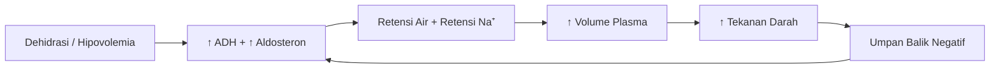

# Antidiuretic Hormone (ADH) / Vasopresin

**Antidiuretic Hormone (ADH)**, juga dikenal sebagai **vasopresin** atau **arginine vasopressin (AVP)**, adalah hormon yang diproduksi di hipotalamus dan disimpan serta dilepaskan dari kelenjar pituitari posterior. Hormon ini berperan penting dalam mengatur keseimbangan air, elektrolit (seperti natrium), dan tekanan darah dalam tubuh.

---

## 🎯 Fungsi Utama ADH

### 1. Meningkatkan Reabsorpsi Air di Ginjal
- ADH bekerja pada **tubulus kolektif** dan **bagian akhir tubulus distal**.
- Menyebabkan peningkatan permeabilitas dinding sel terhadap air melalui pengenalan **aquaporin-2** ke membran sel.
- **Hasil**: Urin lebih pekat dan volume urin berkurang.

### 2. Mempertahankan Volume Darah dan Tekanan Darah
- Dengan menahan air, ADH meningkatkan **volume plasma**.
- Membantu menjaga tekanan darah, terutama dalam kondisi:
  - **Hipovolemia** (kekurangan volume darah)
  - **Hipotensi** (tekanan darah rendah)

### 3. Mengatur Osmolalitas Darah
- ADH dilepaskan saat **osmolalitas darah meningkat** (misalnya karena dehidrasi).
- Merangsang **rasa haus** dan mengurangi ekskresi air.

---

## ⚙️ Regulasi dan Stimulasi Pelepasan ADH

| Sensor | Lokasi | Stimulus | Respons |
|--------|--------|----------|---------|
| **Osmoreseptor** | Hipotalamus | ↑ Osmolalitas darah (>285 mOsm/kg) | ↑ Sekresi ADH + rasa haus |
| **Baroreseptor** | Atrium jantung, arteri karotis, arkus aorta | ↓ Tekanan/volume darah (>10%) | ↑ Sekresi ADH untuk retensi air |

► **Mekanisme Integratif**: 
- Stimulus osmotik lebih sensitif (perubahan 1-2% sudah memicu respons).
- Stimulus volume/tekanan lebih kuat namun membutuhkan perubahan lebih besar (>10%).
- Kedua sistem bekerja sinergis untuk mempertahankan homeostasis cairan.

---

## ⚠️ Gangguan Keseimbangan ADH

### 🔻 Defisiensi ADH: Diabetes Insipidus

| Tipe | Penyebab | Mekanisme |
|------|----------|-----------|
| **Diabetes Insipidus Sentral** | Kerusakan hipotalamus/pituitari (trauma, tumor, infeksi, idiopatik) | Produksi atau pelepasan ADH berkurang/hilang |
| **Diabetes Insipidus Nefrogenik** | Mutasi reseptor V₂, obat (litium), penyakit ginjal kronis | Ginjal tidak merespons ADH meskipun kadar hormon normal |

**Gejala Klinis**:
```
• Poliuria (urin >3 L/hari, bisa mencapai 10-20 L)
• Polidipsia (rasa haus berlebihan)
• Dehidrasi jika asupan cairan tidak mencukupi
• Hipernatremia (natrium darah tinggi)
• Urin sangat encer (osmolalitas <300 mOsm/kg)
```

### 🔺 Produksi ADH Berlebihan: SIADH
**Syndrome of Inappropriate ADH Secretion**

**Penyebab Umum**:
- 🫁 **Paru**: Karsinoma sel kecil paru, pneumonia, TB
- 🧠 **Saraf**: Stroke, perdarahan subarakhnoid, meningitis
- 💊 **Obat-obatan**: Karbamazepin, SSRI, morfin, siklofosfamid
- 🦠 **Lainnya**: Nyeri, stres pasca-operasi, mual berat

**Kriteria Diagnosis SIADH**:
1. Hiponatremia dengan hipoosmolalitas serum
2. Osmolalitas urin yang tidak tepat tinggi (>100 mOsm/kg)
3. Natriuresis urin (>40 mEq/L) dengan asupan natrium normal
4. Euvolemia klinis (tanpa edema atau dehidrasi)
5. Fungsi adrenal, tiroid, dan ginjal normal

**Gejala Klinis** (terkait hiponatremia):
```
• Ringan: Mual, malaise, sakit kepala
• Sedang: Disorientasi, kelelahan, kram otot
• Berat: Kejang, stupor, koma, herniasi otak
```

---

## 🔬 Diagnosis dan Pengujian

### Tes Fungsi ADH

| Tes | Prosedur | Interpretasi |
|-----|----------|--------------|
| **Water Deprivation Test** | Puasa cairan 8-12 jam, pantau berat badan, osmolalitas urin & serum | DI: urin tetap encer meski dehidrasi; Normal/psikogenik: urin mengental |
| **Desmopressin Challenge** | Pemberian desmopressin sintetik setelah water deprivation | Sentral: respons ↑ osmolalitas urin; Nefrogenik: tidak ada respons |
| **Pengukuran ADH Plasma** | Radioimmunoassay atau ELISA | Membantu diferensiasi, namun jarang digunakan rutin |
| **Pemeriksaan Penunjang** | MRI hipotalamus-hipofisis, skrining tumor, evaluasi obat | Identifikasi penyebab struktural atau iatrogenik |

---

## ↔️ Perbedaan ADH dengan Aldosteron

| Aspek | **ADH (Vasopresin)** | **Aldosteron** |
|-------|---------------------|----------------|
| **Sumber** | Hipotalamus (sekresi: neurohipofisis) | Korteks adrenal (zona glomerulosa) |
| **Kelas Hormon** | Peptida (9 asam amino) | Steroid (turunan kolesterol) |
| **Target Utama** | Tubulus kolektif ginjal | Tubulus distal & kolektif ginjal |
| **Mekanisme Aksi** | ↑ Aquaporin-2 → ↑ permeabilitas air | ↑ Enzim Na⁺/K⁺-ATPase & channel Na⁺ → ↑ reabsorpsi Na⁺ |
| **Zat yang Diatur** | **Air** (bebas solut) | **Natrium** (air mengikuti secara osmotik) |
| **Efek pada Kalium** | Tidak langsung | ↑ Ekskresi K⁺ (risiko hipokalemia) |
| **Stimulus Sekresi** | ↑ Osmolalitas, ↓ volume/tekanan darah | ↑ Renin-Angiotensin, ↑ K⁺ serum, ↓ Na⁺ |
| **Reseptor** | V₁ (vaskular), V₂ (renal) | Mineralokortikoid (sitoplasmik/nuklear) |
| **Onset Efek** | Cepat (menit-jam) | Lambat (jam-hari, via transkripsi gen) |

### 🔄 Sinergi ADH dan Aldosteron


---

## 💊 Aspek Terapeutik

### Agonis ADH (Desmopressin)
- **Indikasi**: Diabetes insipidus sentral, enuresis nokturnal, hemofilia A ringan, von Willebrand disease
- **Keunggulan**: Selektif reseptor V₂, durasi kerja lebih panjang, minimal efek vasokonstriksi

### Antagonis ADH (Vaptans)
- **Contoh**: Tolvaptan, Conivaptan
- **Indikasi**: SIADH refrakter, hiponatremia euvolemik/hipervolemik
- **Mekanisme**: Blok reseptor V₂ → aquaresis (ekskresi air bebas tanpa kehilangan elektrolit)

### Manajemen SIADH
1. **Restriksi cairan** (langkah pertama, 800-1000 mL/hari)
2. **Koreksi hiponatremia bertahap** (maks 8-10 mEq/L/24 jam untuk hindari osmotic demyelination)
3. **Vaptans** untuk kasus refrakter
4. **Terapi penyebab dasar** (misal: hentikan obat pemicu, tangani tumor)

---