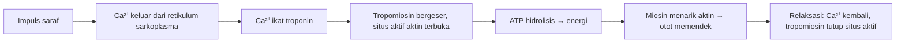

# 🦴 BAB 4: SISTEM GERAK MANUSIA  
> *Rangkuman Materi Biologi SMA*

  
*Sumber: geniusvv, pixabay.com*

---

## 📋 Daftar Isi
- [🎯 Fungsi Rangka Manusia](#-fungsi-rangka-manusia)
- [🦴 A. Rangka Tubuh](#-a-rangka-tubuh)
- [🔬 B. Struktur & Jenis Tulang](#-b-struktur--jenis-tulang)
- [🔄 C. Persendian (Artikulasi)](#-c-persendian-artikulasi)
- [💪 D. Otot Rangka](#-d-otot-rangka)
- [⚠️ E. Gangguan Sistem Gerak](#️-e-gangguan-sistem-gerak)
- [🔧 F. Teknologi Sistem Gerak](#-f-teknologi-sistem-gerak)
- [🧠 Poin Penting](#-poin-penting)

---

## 🎯 Fungsi Rangka Manusia

```
✅ Memberi bentuk & postur tubuh
✅ Melindungi organ lunak (otak, jantung, paru-paru)
✅ Penyangga berat badan
✅ Tempat melekatnya otot rangka
✅ Mendukung terjadinya gerakan
✅ Hematopoiesis (pembentukan sel darah)
✅ Penyimpanan mineral (Ca, P) & energi (lemak)
✅ Fungsi imunologis
```

---

## 🦴 A. Rangka Tubuh

### 🔹 Klasifikasi Rangka

| Jenis | Komponen Utama | Fungsi |
|-------|---------------|--------|
| **Rangka Aksial** (Sumbu Tubuh) | Tengkorak, tulang belakang, tulang dada, tulang rusuk | Melindungi organ vital, menopang tubuh |
| **Rangka Apendikular** (Anggota Gerak) | Gelang bahu, lengan, gelang panggul, kaki | Alat gerak aktif, manipulasi objek |

### 🔹 Rangka Aksial Detail

```
🦴 TENGKORAK
├── Kranial (tempurung): lindungi otak
├── Fasial (wajah): bentuk wajah, tempat otot
├── Tulang telinga dalam: transmisi suara
└── Hioid: tempat melekat otot lidah & menelan

🦴 TULANG BELAKANG (26 ruas)
├── Menopang kepala & tubuh
├── Melindungi sumsum tulang belakang
├── Tempat melekat rusuk
└── Menentukan postur

🦴 DADA & RUSUK
├── Sternum: manubrium, korpus, processus xiphoideus
├── Rusuk sejati: 7 pasang → langsung ke sternum
├── Rusuk palsu: 3 pasang → ke rusuk atas
└── Rusuk melayang: 2 pasang → ujung bebas
```

### 🔹 Rangka Apendikular Detail

```
🔸 GELANG BAHU
├── Skapula (belikat)
└── Klavikula (selangka)

🔸 ANGGOTA GERAK ATAS
├── Humerus → pangkal lengan
├── Radius & Ulna → lengan bawah
├── Karpal → pergelangan tangan
├── Metakarpal → telapak tangan
└── Falangus → jari tangan

🔸 GELANG PANGGUL (Pelvis)
├── Ilium (usus)
├── Pubis (kemaluan)
└── Iskium (duduk)

🔸 ANGGOTA GERAK BAWAH
├── Femur → paha
├── Patela → tempurung lutut
├── Tibia & Fibula → kering & betis
├── Tarsal → pergelangan kaki
├── Metatarsal → telapak kaki
└── Falangus → jari kaki
```

---

## 🔬 B. Struktur & Jenis Tulang

### 🔹 Lapisan Tulang (Luar → Dalam)

```
1️⃣ PERIOSTEUM
   • Jaringan ikat fibrosa + osteoblas
   • Fungsi: tempat melekat otot, nutrisi, perbaikan tulang

2️⃣ TULANG KOMPAK
   • Padat, halus, kuat
   • Mengandung Ca₃(PO₄)₂ & CaCO₃

3️⃣ TULANG SPONS
   • Berongga, berisi sumsum merah

4️⃣ ENDOSTEUM
   • Lapisan pembatas rongga sumsum

5️⃣ SUMSUM TULANG
   • Produksi eritrosit, leukosit, trombosit
```

### 🔹 Bentuk Tulang

| Jenis | Ciri | Contoh |
|-------|------|--------|
| **Pipa** | Silindris panjang | Humerus, Femur, Ulna |
| **Pendek** | Kubus, pendek | Karpal, Tarsal |
| **Pipih** | Lempengan | Tengkorak, Rusuk, Sternum |
| **Tidak Beraturan** | Bentuk kompleks | Vertebrae |
| **Sesamoid** | Kecil, bulat, di sendi | Patela |

### 🔹 Proses Osifikasi (Pembentukan Tulang)

```
🔄 OSIFIKASI INTRAMEMBRAN
Sel mesenkim → Osteoblas → Sekresi osteoid → Kalsifikasi → Tulang
• Terjadi langsung, tanpa tulang rawan perantara
• Contoh: tulang pipih tengkorak

🔄 OSIFIKASI ENDOKONDRIAL
Tulang rawan → Kalsifikasi → Diganti tulang keras
• Dimulai sejak embrio, selesai usia 18-25 tahun
• Contoh: tulang pipa, vertebrae
```

### 🔹 Faktor Pertumbuhan Tulang
```
🧬 Genetik (herediter)
🥗 Nutrisi (Ca, P, vitamin D)
🧪 Hormon: PTH, Kalsitonin, Somatotrofin, Tiroksin, Hormon kelamin
🧠 Sistem saraf
```

---

## 🔄 C. Persendian (Artikulasi)

### 🔹 Komponen Sendi
```
• Ligamen → cegah gerakan berlebihan
• Kapsul sendi → penahan ligamen
• Cairan sinovial → pelumas, kurangi gesekan
• Tulang rawan hialin → bantalan anti-nyeri
• Bursa → kantung pelumas tambahan
```

### 🔹 Klasifikasi Persendian

#### 📐 Berdasarkan Struktur
| Tipe | Rongga Sendi | Penghubung | Contoh |
|------|-------------|------------|--------|
| **Fibrosa** | ❌ Tidak ada | Jaringan ikat fibrosa | Sutura tengkorak |
| **Kartilago** | ❌ Tidak ada | Tulang rawan | Simfisis pubis |
| **Sinovial** | ✅ Ada | Ligamen + kapsul | Lutut, bahu, siku |

#### 🔄 Berdasarkan Gerakan
```
🔒 SINARTROSIS (Sendi Mati)
├── Sinfibrosis: jaringan fibrosa (sutura kepala)
└── Sinkondrosis: tulang rawan hialin (epifisis-diafisis)

🔓 AMFIARTROSIS (Gerak Terbatas)
├── Simfisis: kartilago (antar vertebrae)
├── Sindesmosis: serabut + ligamen (tibia-fibula)
└── Gomfosis: bentuk kerucut (gigi-alveolus)

🔓🔓 DIARTROSIS (Sendi Gerak Bebas / Sinovial)
┌─────────────────────────────────┐
│ Jenis      │ Gerakan          │ Contoh          │
├─────────────────────────────────┤
│ Engsel     │ 1 arah           │ Siku, lutut     │
│ Peluru     │ Semua arah       │ Bahu, panggul   │
│ Pelana     │ 2 arah           │ Ibu jari tangan │
│ Putar      │ Rotasi           │ Atlas-axis      │
│ Luncur     │ Geser            │ Pergelangan     │
│ Kondiloid  │ 2 arah (oval)    │ Pergelangan tangan│
└─────────────────────────────────┘
```

---

## 💪 D. Otot Rangka

### 🔹 Fungsi & Sifat Otot
```
✅ FUNGSI:
• Menggerakkan tulang (alat gerak aktif)
• Menopang postur tubuh
• Produksi panas tubuh

✅ SIFAT:
• Kontraktilitas: mampu memendek
• Eksitabilitas: responsif terhadap impuls saraf
• Ekstensibilitas: mampu meregang
• Elastisitas: kembali ke panjang semula
```

### 🔹 Struktur Otot Rangka (Hierarki)
```
OTOT RANGKA
│
├── Epimisium (selubung luar)
│   │
│   ├── Fasikulus (berkas serat otot)
│   │   │
│   │   ├── Perimisium
│   │   │   │
│   │   │   ├── Serat otot (miofibril + sarkolema)
│   │   │   │   │
│   │   │   │   ├── Endomisium
│   │   │   │   │   │
│   │   │   │   │   ├── Miofibril
│   │   │   │   │   │   ├── Miofilamen tebal → Miosin
│   │   │   │   │   │   └── Miofilamen tipis → Aktin
│   │   │   │   │   │
│   │   │   │   │   └── Sarkomer (unit fungsional kontraksi)
```

### 🔹 Mekanisme Kontraksi Otot (Sliding Filament Theory)


### 🔹 Sumber Energi Otot
```
⚡ ATP (langsung)
⚡ Kreatin fosfat (cadangan cepat)
⚡ Glikogen → glukosa → respirasi seluler (cadangan jangka panjang)
```

### 🔹 Pola Kerja Otot
| Tipe | Definisi | Contoh |
|------|----------|--------|
| **Antagonis** | Kerja berlawanan arah | Bisep (fleksi) vs Trisep (ekstensi) |
| **Sinergis** | Kerja searah, saling bantu | Otot antar rusuk saat inspirasi |

---

## ⚠️ E. Gangguan Sistem Gerak

### 🔹 Gangguan pada Tulang
```
🦴 FRAKTUR: Patah tulang akibat trauma > kekuatan tulang

🦴 KELAINAN TULANG BELAKANG:
├── Kifosis: melengkung ke belakang (bungkuk)
├── Lordosis: melengkung ke depan
├── Skoliosis: melengkung ke samping
└── Subluksasi: pergeseran vertebra leher

🦴 GANGGUAN FISIOLOGIS:
├── Osteoporosis: tulang keropos (kurang Ca/hormon)
├── Rakitis: tulang lunak pada anak (kurang vit.D)
├── Mikrosefalus: tengkorak kecil
├── Hidrosefalus: penumpukan cairan otak
└── Layu semu: kelemahan otot akibat infeksi
```

### 🔹 Gangguan pada Sendi
```
🔗 Terkilir: ligamen teregang/robek
🔗 Dislokasi: tulang keluar dari posisi sendi
🔗 Osteoartritis: degenerasi tulang rawan sendi
🔗 Ankilosis: sendi kaku, tidak bisa gerak
🔗 Urai sendi: robeknya kapsul sendi
🔗 Artritis: peradangan sendi (nyeri, bengkak)
```

### 🔹 Gangguan pada Otot
```
💢 Hipertrofi: otot membesar (latihan/penyakit)
💢 Atrofi: otot mengecil (tidak dipakai/saraf rusak)
💢 Distrofi otot: degenerasi genetik
💢 Tetanus: kejang terus-menerus (toksin bakteri)
💢 Kram: kontraksi tiba-tiba + nyeri
💢 Miastenia gravis: kelemahan otot autoimun
💢 Otot robek/terkilir: trauma fisik
```

---

## 🔧 F. Teknologi Sistem Gerak

```
🏥 PENGOBATAN & REHABILITASI:
• Gips, bidai, traksi → imobilisasi fraktur
• Operasi internal: plat, sekrup, pen
• Kemoterapi/radioterapi → tumor tulang
• Penggantian sendi (prostesis logam)
• Transplantasi sumsum tulang

🤖 TEKNOLOGI BANTUAN:
• Implan tulang & viskosuplementasi (asam hialuronat)
• Pencangkokan tulang rawan
• Brace/penyangga → koreksi skoliosis bayi
• Kaki/tangan bionik (prostetik canggih)
• Kursi roda & alat bantu mobilitas
• Koreksi kaki-O dengan orthotic
```

---

## 🧠 Poin Penting

```
✨ Rangka = alat gerak PASIF | Otot = alat gerak AKTIF
✨ Osifikasi endokondrial selesai usia 18-25 tahun
✨ Sendi sinovial = paling bebas gerak, punya cairan pelumas
✨ Kontraksi otot butuh: Ca²⁺ + ATP + impuls saraf
✨ Osteoporosis bisa dicegah: cukup Ca, vit.D, olahraga beban
✨ Fraktur sembuh dengan: imobilisasi + nutrisi + waktu
```